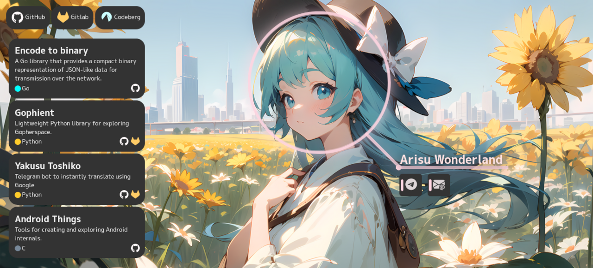

<p align="center">
    <h1 align="center">Website</h1>
    <p>A single page website to display pinned repositories and links to social networks.</p>
</p>



## Getting started

1. Install dependencies:
```bash
npm install
```
2. Run Vite
    * Start a development server: `npm run dev`
    * Build for production: `npm run build`

## Contributing

Before you create a new pull request, make sure that your changes:

* Do not depend on JS (or provide a placeholder at least)
* Display correctly in Firefox 68
* Can adapt to **any** viewport

## Attribution

* **Simple Icons**: [simple-icons/simple-icons](https://github.com/simple-icons/simple-icons)
* **Bootstrap Icons**: [twbs/icons](https://github.com/twbs/icons)
